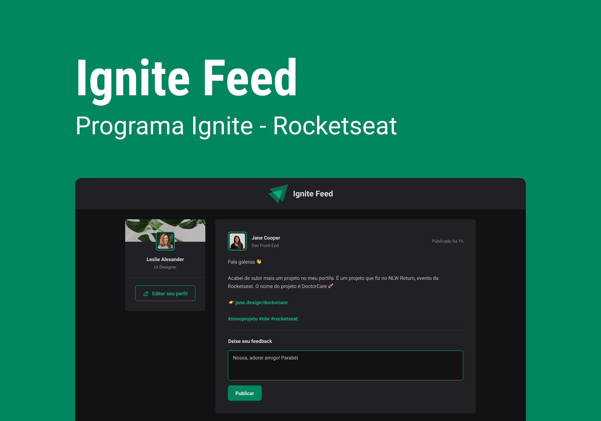

<h1 align="center"> Ignite Feed </h1>

  

## 🚀 Tecnologias

Esse projeto foi desenvolvido com as seguintes tecnologias:

- HTML e CSS
- JavaScript
- TypeScript
- React.js
- Git e Github
- Figma

## 🔖 Layout

Você pode visualizar o layout do projeto através [DESSE LINK](https://www.figma.com/file/S9qZeC1x6rmNp7NVXs0utN/Ignite-Feed-(Community)?type=design&node-id=26%3A12&mode=design&t=XJhSwfOEFr4lsSun-1). É necessário ter conta no [Figma](https://figma.com) para acessá-lo.

---

Feito com ♥ by Larisa Wolff